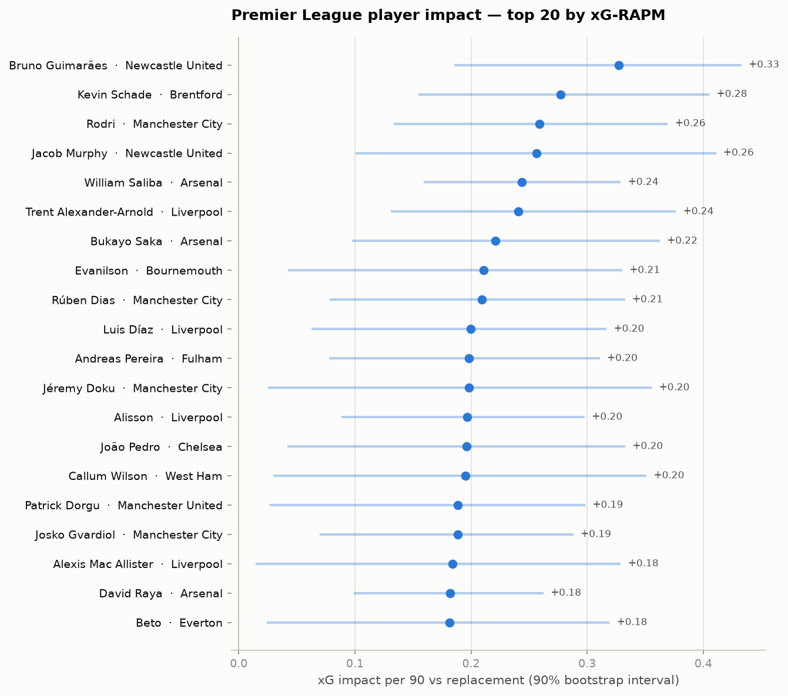
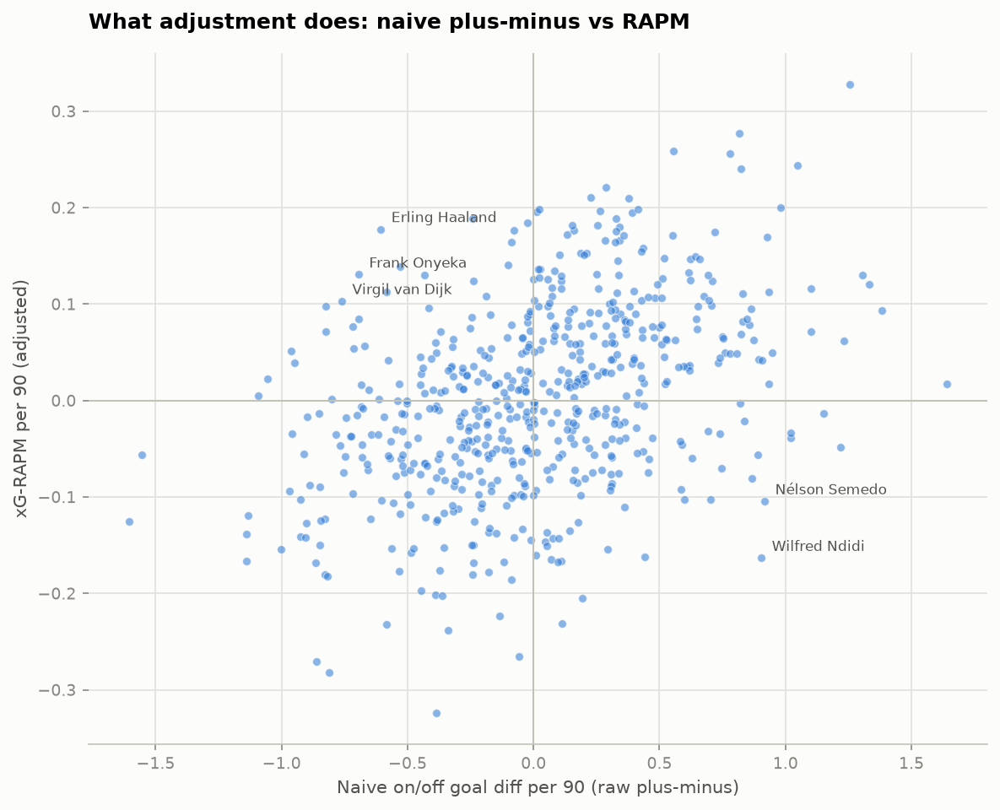
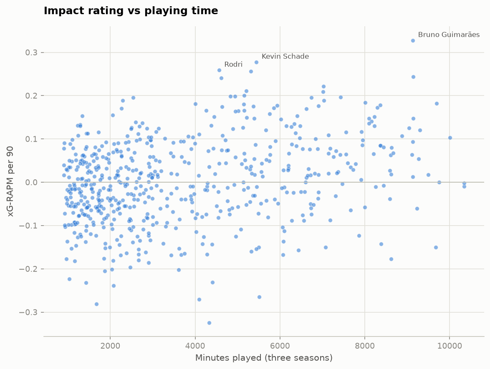

# Premier League Player Impact Ratings

**Who actually moves the needle when they're on the pitch?** This project ranks
Premier League players (2023/24 – 2025/26) by their on-pitch impact, built up in
three stages: the intuitive **on/off goal plus-minus**, its failure modes, and the
fix — **regularized adjusted plus-minus (RAPM)** on match *stints*, with an
**expected-goals response** for a cleaner signal.



## The idea

Goal plus-minus asks a simple question: *how does a team's goal difference per 90
change when a player is on the pitch versus off it?* Simple — and, on its own,
badly misleading in soccer:

1. **Small samples.** Goals are rare (~2.8/match). A few lucky stints make a
   squad player look elite.
2. **Collinearity.** Regular starters share 70%+ of their minutes; on/off numbers
   describe the *team*, not the player.
3. **Substitution bias.** Subs enter in non-random game states (chasing,
   protecting, garbage time).

The fix, borrowed from NBA analytics and applied to soccer in the academic
literature (Sæbø & Hvattum 2015; Kharrat, López Peña & Boukas 2020), is to regress
**stint outcomes on everyone on the pitch simultaneously**, with ridge
regularization to tame the collinearity.

## Method

**Stints.** Each match is segmented into maximal intervals with an unchanged set
of players — boundaries at substitutions and red cards. Every stint records both
rosters, its duration, and the goals and xG created by each side inside it.

**The regression.** One row per stint (~7,600 of them):

- **Response:** stint goal differential (home − away), scaled to per-90; rows
  weighted by stint duration. The xG variant swaps in stint xG differential.
- **Player columns:** +1 if on the pitch for the home side, −1 for the away side.
  Players under 900 career minutes pool into one *replacement* column, so
  coefficients read as **impact per 90 over a replacement-level player**.
- **Controls:** an unpenalized intercept (home advantage — the model recovers the
  league's true ≈ +0.3–0.4 goals/90 from data) and a man-count differential
  (red cards).
- **Ridge λ** chosen by cross-validation with folds **grouped by match**, so no
  match straddles the train/test split.
- **Uncertainty** from a cluster bootstrap (resampling matches, 500 draws).

**Why xG?** Goals are a noisy readout of match control; chance quality carries
more signal per minute and strips out finishing/keeper luck. Empirically, with
three full seasons the two responses end up close (split-half reliability ≈ 0.49
Spearman-Brown for both; xG's bootstrap signal-to-noise is modestly better at
1.36 vs 1.30) — the reliability test in
[notebook 05](notebooks/05_validation_and_final_rankings.ipynb) reports the
numbers rather than assuming the answer.



## Validation

- **Hard reconciliation gates** on every match: stint goals sum exactly to the
  final score; every match starts 11v11 and player counts only ever fall; each
  player's summed stint minutes equal their appearance interval; final scores
  match an independent source (football-data.co.uk).
- **Split-half reliability:** the model is fit on two disjoint halves of the
  match sample and the two rating vectors are correlated.
- **Sanity recoveries:** home advantage and the value of a man advantage are
  estimated, not assumed — both land where the literature says they should.
- **Unit tests** cover the stint builder's edge cases: same-minute double subs,
  red cards, sub-of-sub chains, stoppage-time subs that extend the match clock.

## Results

Top 10 by xG-RAPM, 2023/24–2025/26 (impact per 90 over a replacement-level
player, 90% bootstrap interval):

| # | Player | Team | Minutes | xG-RAPM /90 | 90% CI |
|---|--------|------|--------:|------------:|--------|
| 1 | Bruno Guimarães | Newcastle United | 9,133 | **+0.33** | +0.19 … +0.43 |
| 2 | Kevin Schade | Brentford | 5,445 | **+0.28** | +0.16 … +0.41 |
| 3 | Rodri | Manchester City | 4,564 | **+0.26** | +0.13 … +0.37 |
| 4 | Jacob Murphy | Newcastle United | 5,314 | **+0.26** | +0.10 … +0.41 |
| 5 | William Saliba | Arsenal | 9,139 | **+0.24** | +0.16 … +0.33 |
| 6 | Trent Alexander-Arnold | Liverpool | 4,617 | **+0.24** | +0.13 … +0.38 |
| 7 | Bukayo Saka | Arsenal | 7,024 | **+0.22** | +0.10 … +0.36 |
| 8 | Evanilson | Bournemouth | 5,201 | **+0.21** | +0.04 … +0.33 |
| 9 | Rúben Dias | Manchester City | 7,012 | **+0.21** | +0.08 … +0.33 |
| 10 | Luis Díaz | Liverpool | 5,157 | **+0.20** | +0.06 … +0.32 |

The model finds the names an informed fan would expect (Rodri's famous on/off
effect survives full adjustment; Saliba and Dias anchor the two best defenses)
alongside genuinely interesting cases — Bruno Guimarães tops the board on
enormous minutes, and role players like Kevin Schade and Jacob Murphy post
strong per-90 impact that raw plus-minus hides. Every interval is wide: three
seasons of stints identifies individual impact only coarsely, and the chart
says so honestly.

Full rankings live in [outputs/rankings.csv](outputs/rankings.csv); the
notebooks tell the full story:

| Notebook | What it shows |
|---|---|
| [01 — Data & EDA](notebooks/01_data_and_eda.ipynb) | The stint table and its reconciliation gates |
| [02 — Naive plus-minus](notebooks/02_naive_plusminus.ipynb) | The baseline and its three failure modes, demonstrated |
| [03 — RAPM](notebooks/03_rapm.ipynb) | The adjusted model on goals |
| [04 — xG-RAPM](notebooks/04_xg_rapm.ipynb) | The xG response and method comparison |
| [05 — Validation & rankings](notebooks/05_validation_and_final_rankings.ipynb) | Reliability, uncertainty, final tables |



## Data

All free sources. **[Understat](https://understat.com)** supplies everything the
model needs from a single, internally consistent source: match rosters with
substitution linkage (each sub's record points to the player they replaced, whose
`time` field is the sub minute — verified exact against real matches), red-card
exits, and shot-level xG with minutes. Final scores are cross-checked against
**[football-data.co.uk](https://www.football-data.co.uk)** CSVs.

> The original plan was FBref match reports via `soccerdata`; FBref now
> hard-blocks scraping (HTTP 403 even with browser-impersonation TLS), which is
> itself a useful data-engineering lesson: design the pipeline so the source is
> swappable and every raw response is cached.

Known approximations, accepted and documented: Understat's clock caps regulation
at 90 (stoppage-time subs chain past it), shot minutes are integers, and a shot
at an exact stint boundary is attributed to the later stint (±1 min ambiguity).

## Reproduce it

```bash
uv sync                 # Python 3.12 environment
make all                # scrape (cached, resumable) -> build -> test -> model -> charts
make notebooks          # execute the narrative notebooks in place
```

`plimpact` is also a CLI: `uv run plimpact scrape | build | model | outputs`.

```
src/plimpact/
├── scrape.py     # cached, resumable Understat + football-data pulls
├── parse.py      # raw JSON -> typed appearance/shot records
├── stints.py     # match -> stint segmentation (the core data structure)
├── naive.py      # on/off plus-minus baseline
├── rapm.py       # sparse design matrix, ridge, grouped CV, bootstrap
├── model.py      # orchestration: naive -> RAPM -> xG-RAPM -> ratings.parquet
├── validate.py   # reconciliation gates
└── viz.py        # README charts
```

## References

- Sæbø, O.D. & Hvattum, L.M. (2015). *Evaluating the efficiency of the
  association football transfer market using regression-based player ratings.*
- Kharrat, T., López Peña, J. & Boukas, I. (2020). *Plus-minus player ratings for
  soccer.* Annals of Operations Research.
- Sill, J. (2010). *Improved NBA adjusted plus-minus using regularization and
  out-of-sample testing.* MIT Sloan Sports Analytics Conference.
